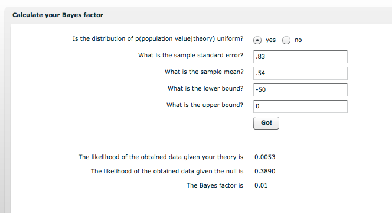

#### Article ID: crIXN
#### Pilot: Mike Frank
#### Co-pilot: Tom Hardwicke
#### Start date: 8/10/17
#### End date: 

-------

#### Methods summary: 

The authors were interested in whether saccades were drawn to faces with direct, rather than averted gaze. They used contrastive flash suppression to suppress conscious awareness of a pair of faces, which were presented to the non-dominant eye during one of two time periods. The measures were:

1. 2AFC about which time period contained the faces - predicted to be at chance due to the presence of CFS (manipulation check)

2. Face receiving the first saccade - predicted to be above chance to the direct gaze face.

------

#### Target outcomes: 

For this article you should focus on the findings reported in section 2.2 Results. Specifically, you should attempt to reproduce all descriptive and inferential analyses reported in the text below and associated tables/figures:

> On 58.5% (±4.7 SEM) of all trials, on average, participants indicated to be least confident regarding the appearance of the faces. In these trials, participants were unable to correctly guess the presentation of the faces in the manual 2AFC task (M = 50.54% (±0.84 SEM); one-sample t-test against 50%: t(25) = 0.65, p > 0.05; Fig. 2A), indicating that the faces were effectively suppressed from awareness. In addition, Bayes analysis of participants’ task performance yielded Bayes factors of 0.01 and 0.04 for uniform distributions above and below 50%, respectively, providing substantial evidence for the null hypothesis, that is, no difference from a chance level of 50%.

> Regarding participants’ eye movements at the lowest confidence level, we first probed whether saccades were more frequently directed towards the actual position of the faces in comparison to all possible locations in which the face stimuli could potentially appear. To this end, we computed the proportion of saccadic endpoints landing on the two concurrently presented faces in relation to saccadic endpoints landing within all possible face locations. Saccades were significantly more frequently directed towards the actually presented face stimuli compared to all possible locations of the faces (M = 49.83% (±2.32 SEM); one sample t-test against 40.7% representing the area covered by two faces relative to all possible locations of the faces: t(25) = 3.93, p < 0.001). Of these face-directed saccades, the mean saccadic preference index across participants was M = 10.41% (±4.95 SEM) (Fig. 2B), which was significantly larger than 0 (one sample t-test: t(25) = 2.10; p = 0.046; d = 0.41). This indicates that relative to all face-directed saccades, saccades were ∼10% more often guided towards faces with direct gaze compared to averted gaze. In three participants, saccadic indices were identified as statistical outliers, because they were either 1.5 times the interquartile range above the 75th percentile or below the 25th percentile of the group distribution. After removal of these outliers, the mean saccadic preference index was still significantly above 0 (M = 8.72% (±3.79 SEM); one sample t-test: t(22) = 2.30; p = 0.031; d = 0.48). No difference in saccade latencies between direct (M = 446.94 ms (±9.51 SEM)) and averted gaze (M = 429.96 ms (±9.51 SEM); paired sample t-test: t(25) = 0.89; p = 0.38; d = 0.18) was found.


------

```{r global_options, include=FALSE}
knitr::opts_chunk$set(echo=TRUE, warning=FALSE, message=FALSE)
```

```{r}
sem <- function (x) {
  sd(x, na.rm=TRUE) / sqrt(sum(!is.na((x))))
}
```


## Step 1: Load packages

```{r}
library(tidyverse) # for data munging
library(knitr) # for kable table formating
library(readxl) # import excel files
library(CODreports) # custom report functions
library(magrittr) # for compound pipes
```

## Step 2: Load data

```{r}
d1 <- read_excel("data/data.xls")
```

Check the structure of the data.

```{r}
glimpse(d1)
```

## Step 3: Tidy data

```{r}
d_tidy <- d1 %>%
  rename(subid = Subject, 
         sex = Sex, 
         age = `Age (years)`, 
         two_afc = `2AFC performance`, 
         unsure = `Prop. highly unsure`, 
         exclude = `Reason to exclude`,
         prop_saccades = `Prop. saccades towards actual faces vs. face area`,
         chance = `Chance level (i.e. area covered by two faces relative to all faces)`,
         saccade_pref  = `Saccadic preference index (d-a)/(d+a) (%)`, 
         latency_direct = `Mean saccade latency (direct gaze)`,
         latency_averted = `Mean saccade latency (averted gaze)`) %>%
  select(1:11)
```


The authors write that:

> Thirty-four volunteers took part in experiment 1. Five partici- pants from experiment 1 were excluded due to poor eyetracking quality. The data of another three participants were discarded, because they were able to indicate the appearance of the faces with above-chance accuracy and could thus not be considered unaware of the face stimuli (see Section 2.1.4). After applying our exclusion criteria, the final sample consisted of twenty-six participants (21 female; mean age: 24.65 (±0.76 SEM) years). 

Check this. 

```{r}
nrow(d_tidy)
```
Before exclusions, N matches.

```{r}
sum(is.na(d_tidy$exclude))
```
Excluding marked participants yields 26, also matches.

```{r}
d_tidy %<>% 
  filter(is.na(exclude))

sum(d_tidy$sex == "F")
mean(d_tidy$age) # with exclusions
mean(d1$`Age (years)`) # no exclusions
```

Number of females matches, although mean age is a little different numerically. It's actually closer to the mean across all participants. Unclear what's happened. 

## Step 4: Run analysis

### Pre-processing

All preprocessing is done for us.

### Descriptive and inferential statistics

> On 58.5% (±4.7 SEM) of all trials, on average, participants indicated to be least confident regarding the appearance of the faces. 


```{r}
# mean
compareValues(obtainedValue = mean(d_tidy$unsure)*100, reportedValue = 58.5)

# standard error
compareValues(obtainedValue = sem(d_tidy$unsure)*100,  
              reportedValue = 4.7)
```


> In these trials, participants were unable to correctly guess the presentation of the faces in the manual 2AFC task (M = 50.54% (±0.84 SEM); 

We don't have individual trial-level data for 2AFC, we guess that the 2AFC means provided are those for the lowest-confidence trials. 

```{r}
# mean 
compareValues(obtainedValue = mean(d_tidy$two_afc)*100, reportedValue = 50.54)

# standard error
compareValues(obtainedValue = sem(d_tidy$two_afc)*100,  
                reportedValue = .84)

```

> one-sample t-test against 50%: t(25) = 0.65, p > 0.05; Fig. 2A), indicating that the faces were effectively suppressed from awareness. 

```{r}
twoafc_ttest <- t.test(d_tidy$two_afc - .5) 
twoafc_ttest
```

```{r}
compareValues(obtainedValue = twoafc_ttest$statistic, reportedValue = 0.65)
```


> In addition, Bayes analysis of participants’ task performance yielded Bayes factors of 0.01 and 0.04 for uniform distributions above and below 50%, respectively, providing substantial evidence for the null hypothesis, that is, no difference from a chance level of 50%.

The authors report using an online calculator for Bayes Factors. This link: [http://www.lifesci.sussex.ac.uk/home/Zoltan_Dienes/infer- ence/-bayes_factor.swf]() led us to a calculator. Inputting the settings given returned:


and 



Which provides Bayes factors of Infinity, which are clearly not right. 

> Regarding participants’ eye movements at the lowest confidence level, we first probed whether saccades were more frequently directed towards the actual position of the faces in comparison to all possible locations in which the face stimuli could potentially appear. To this end, we computed the proportion of saccadic endpoints landing on the two concurrently presented faces in relation to saccadic endpoints landing within all possible face locations. Saccades were significantly more frequently directed towards the actually presented face stimuli compared to all possible locations of the faces (M = 49.83% (±2.32 SEM); 

```{r}
# mean 
compareValues(obtainedValue = mean(d_tidy$prop_saccades), reportedValue = 49.83)

# standard error
compareValues(obtainedValue = sem(d_tidy$prop_saccades),  
              reportedValue = 2.32)

```


> one sample t-test against 40.7% representing the area covered by two faces relative to all possible locations of the faces: t(25) = 3.93, p < 0.001). 

```{r}
prop_ttest <- t.test(d_tidy$prop_saccades - 40.7)
prop_ttest
```
```{r}
compareValues(obtainedValue = prop_ttest$statistic, reportedValue = 3.93)
```

> Of these face-directed saccades, the mean saccadic preference index across participants was M = 10.41% (±4.95 SEM) (Fig. 2B), 

```{r}
# mean 
compareValues(obtainedValue = mean(d_tidy$saccade_pref), reportedValue = 10.41)

# standard error
compareValues(obtainedValue = sem(d_tidy$saccade_pref),  
              reportedValue = 4.95)

```


> which was significantly larger than 0 (one sample t-test: t(25) = 2.10; p = 0.046; d = 0.41). This indicates that relative to all face-directed saccades, saccades were ∼10% more often guided towards faces with direct gaze compared to averted gaze. 

```{r}
saccade_ttest <- t.test(d_tidy$saccade_pref)
saccade_ttest
```
```{r}
compareValues(obtainedValue = saccade_ttest$statistic, reportedValue = 2.10)
```

> In three participants, saccadic indices were identified as statistical outliers, because they were either 1.5 times the interquartile range above the 75th percentile or below the 25th percentile of the group distribution. 

```{r}
upper <- quantile(d_tidy$saccade_pref, .75) + IQR(d_tidy$saccade_pref)*1.5
lower <- quantile(d_tidy$saccade_pref, .25) - IQR(d_tidy$saccade_pref)*1.5
d_tidy$saccade_outlier <- d_tidy$saccade_pref < lower | d_tidy$saccade_pref > upper
compareValues(obtainedValue = sum(d_tidy$saccade_outlier), reportedValue = 3)
```


> After removal of these outliers, the mean saccadic preference index was still significantly above 0 (M = 8.72% (±3.79 SEM); 


```{r}
d_tidy_nooutlier <- filter(d_tidy, saccade_outlier == FALSE)

# mean 
compareValues(obtainedValue = mean(d_tidy_nooutlier$saccade_pref), reportedValue = 8.72)

# standard error
compareValues(obtainedValue = sem(d_tidy_nooutlier$saccade_pref),  
              reportedValue = 3.79)

```

> one sample t-test: t(22) = 2.30; p = 0.031; d = 0.48). 

```{r}
saccade_nooutlier_ttest <- t.test(d_tidy_nooutlier$saccade_pref)
saccade_nooutlier_ttest
compareValues(obtainedValue = saccade_nooutlier_ttest$statistic, reportedValue = 2.30)
```

> No difference in saccade latencies between direct (M = 446.94 ms (±9.51 SEM)) 

Note the presence of NAs (missing data). 

```{r}
# mean
compareValues(obtainedValue = mean(d_tidy$latency_direct), 
              reportedValue = 446.94)

# standard error
compareValues(obtainedValue = sem(d_tidy$latency_direct),  
              reportedValue = 9.51)
```

Looks like a copy and paste error on the SD from the Averted condition. 

> and averted gaze (M = 429.96 ms (±9.51 SEM); 

```{r}
# mean
compareValues(obtainedValue = mean(d_tidy$latency_averted), 
              reportedValue = 429.96)

# standard error
compareValues(obtainedValue = sem(d_tidy$latency_averted),  
              reportedValue = 9.51)
```

> paired sample t-test: t(25) = 0.89; p = 0.38; d = 0.18) was found.

```{r}
latency_ttest <- t.test(d_tidy$latency_direct, d_tidy$latency_averted, 
                        paired = TRUE, 
                        var.equal = TRUE)
latency_ttest
```


```{r}
compareValues(obtainedValue = latency_ttest$statistic, .89)
```

Figure 2 (reproduced from above). 


```{r}
# side A
ggplot(data = data.frame(mean = mean(d_tidy$two_afc), 
                         sem = sem(d_tidy$two_afc)),
                         aes(x = 1, y = mean)) + 
  geom_bar(stat = "identity") + 
  geom_linerange(aes(ymin = mean - sem, ymax = mean + sem)) + 
  ylim(0,.6) + 
  xlab("") + ylab("2AFC")
```


```{r}
# side A
ggplot(data = data.frame(mean = mean(d_tidy$saccade_pref), 
                         sem = sem(d_tidy$saccade_pref)),
                         aes(x = 1, y = mean)) + 
  geom_bar(stat = "identity") + 
  geom_linerange(aes(ymin = mean - sem, ymax = mean + sem)) + 
  ylim(0,16) +
  xlab("") + ylab("2AFC")
```


## Step 5: Conclusion

```{r}
codReport(Report_Type = 'joint',
          Article_ID = 'crIXN', 
          Insufficient_Information_Errors = 1,
          Decision_Errors = 0, 
          Major_Numerical_Errors = 2, 
          Minor_Numerical_Errors = 2,
          Author_Assistance = F)
```

Almost all results were successfully reproduced, with two exceptions: 

1. We were uncertain what precise settings for Bayes Factors were employed in the online calculator. (See screenshots).

2. We would like clarification of the SEMs for the direct and averted gaze latencies. It appears that there may be a copy-paste issue as they are identical for the two conditions and don't appear related to the underlying data. 


```{r session_info, include=TRUE, echo=TRUE, results='markup'}
devtools::session_info()
```
